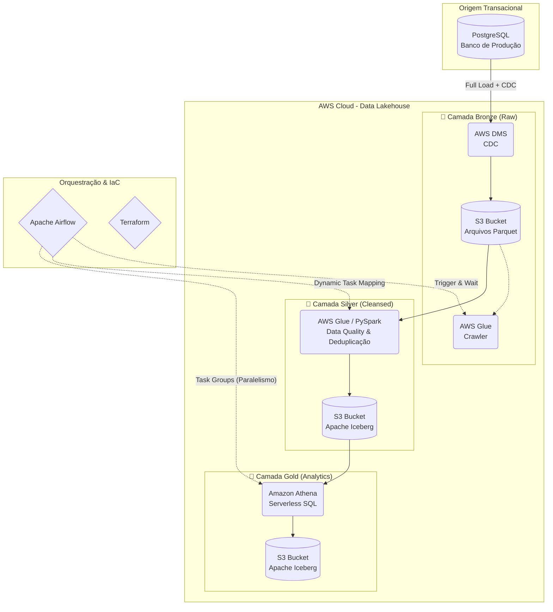

# 🛒 E-Commerce Data Lakehouse: Arquitetura AWS & Apache Iceberg


## 📌 Visão Geral do Projeto
Este projeto implementa uma arquitetura moderna de **Data Lakehouse** de ponta a ponta na nuvem AWS. O objetivo é ingerir, processar e modelar dados do dataset público de e-commerce da Olist, transformando dados transacionais brutos em modelos analíticos otimizados para consumo por ferramentas de Business Intelligence (BI) e Agentes de Inteligência Artificial.

A esteira de dados é totalmente orquestrada e idempotente, garantindo a qualidade e integridade dos dados através do processamento CDC (Change Data Capture) e do formato Apache Iceberg.

## 🏗️ Arquitetura de Dados

O pipeline segue a arquitetura **Medallion** (Bronze, Silver e Gold):



### 🥉 Camada Bronze (Ingestão Raw)
* **Ferramenta:** AWS Database Migration Service (DMS).
* **Processo:** Extração contínua (CDC) do PostgreSQL de produção. Os dados são salvos em sua forma bruta no S3 em formato `.parquet`.
* **Catálogo:** AWS Glue Crawler identifica automaticamente as alterações de schema e atualiza o AWS Glue Data Catalog.

### 🥈 Camada Silver (Limpeza e Padronização)
* **Ferramenta:** AWS Glue Jobs (PySpark) + Apache Iceberg.
* **Processo:** Processamento massivo rodando de forma efêmera e paralela. O script PySpark utiliza *Window Functions* para aplicar deduplicação de registros via micro-batch, lidando inclusive com chaves compostas complexas (ex: `order_id` + `order_item_id`).
* **Storage:** Utilização do comando `MERGE INTO` (Upsert) habilitado pelas transações ACID do formato **Apache Iceberg**, mantendo o histórico e controle de versão no nível do arquivo físico.

### 🥇 Camada Gold (Modelagem Analítica)
* **Ferramenta:** Amazon Athena.
* **Processo:** Construção de lógicas de negócio via `CREATE TABLE AS SELECT` (CTAS), filtrando anomalias (pedidos cancelados) e cruzando entidades.
* **Modelagens Implementadas:**
  1. **OBT (One Big Table):** Tabela desnormalizada com todos os dados granulares para exploração rápida e Machine Learning.
  2. **Star Schema (Modelo Estrela):** Separação em `fact_orders`, `dim_clients`, `dim_products` e `dim_sellers` visando alta performance e redução de custos em ferramentas de BI.
  3. **Data Mart (RFM):** Tabela agregada calculando a Recência, Frequência e Valor Monetário de cada cliente para análise direta de churn e LTV.

## ⚙️ Orquestração (Apache Airflow)
A DAG `lakehouse_pipeline` coordena toda a infraestrutura utilizando recursos avançados do Airflow 2.x:
* **Dynamic Task Mapping (`.expand`):** Cria dinamicamente N tarefas de PySpark na camada Silver baseadas na lista de tabelas, otimizando o paralelismo sem poluir o código.
* **TaskGroups:** Agrupa visualmente a execução da camada Gold, permitindo o `DROP` e `CREATE` simultâneo de todas as tabelas dimensionais e fatos, garantindo a **idempotência** do pipeline.
* **Jinja Templating:** Gerenciamento de variáveis de ambiente do S3 diretamente nos scripts SQL (`{{ var.value.gold_bucket_path }}`).

## 🚀 Como Executar

### Pré-requisitos
* Conta AWS com credenciais configuradas (`~/.aws/credentials`).
* Terraform instalado.
* Astro CLI instalado (para rodar o Apache Airflow localmente).

### Passos
1. **Infraestrutura (Terraform):**
   ```bash
   cd terraform
   terraform init
   terraform apply
   ```
2. **Subir os Scripts PySpark e SQL:**
   Certifique-se de que o arquivo `spark_iceberg_merge.py` e a pasta de queries SQL estão na pasta `include/`.
3. **Iniciar o Airflow:**
   ```bash
   astro dev start
   ```
4. **Execução:**
   Acesse `http://localhost:8080`, ative a DAG `lakehouse_pipeline` e clique em *Trigger DAG*.